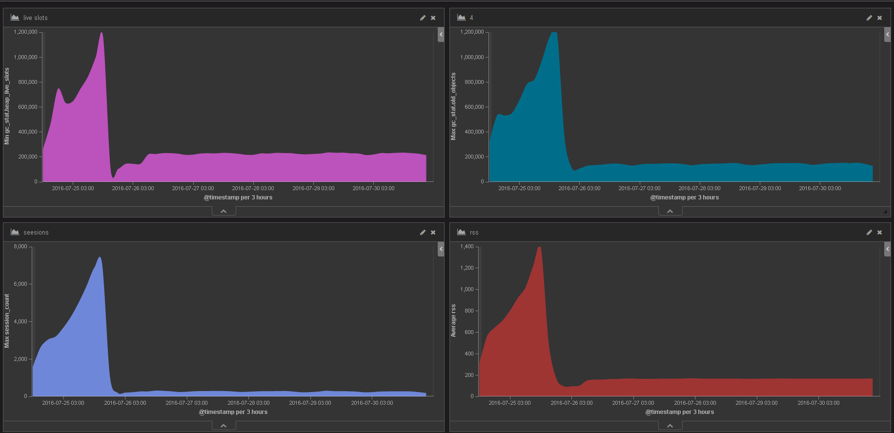

# Note
Из интересных моментов в разработке - пришлось искать причину “утечки памяти” 
Локальные нагрузочные тесты не принесли результатов, пришлось реализовать мониторинг памяти и работы gc в боевой среде. 

Для этого я реализовал простенький [gem (memory_monitor_client)](https://github.com/CoolElvis/memory_monitor_client) который с заданным интервалом кидает по udp  статистику gc и rss. Для агрегации я использовал logstash + kibana. 

Проанализировав полученные данные я обнаружил, что количество объектов растет пропорционально памяти, ничего не обычного. Следующий шаг был посчитать количество соединений на сервере. Настроив сбор данной статистики, обнаружилось, что количество открытых соединений непрерывно растет, хотя было известно, что количество клиентов ограничено. 

Возникла гипотеза -  некоторые сессии просто висят в открытом состоянии, но при этом не шлют никаких данных. Специфика данной ситуации в том, что связь на устройствах не стабильна, так как устройство постоянно перемещается (установлено на автомобиле), причем часто в зонах не уверенного приема сети.   

Чтобы проверить гипотезу, я реализовал механизм [session_sweeper](https://github.com/CoolElvis/gt06_server/blob/master/lib/gt06_server/session_sweeper.rb), который с заданным интервалом пробегает по списку сессий и закрывает, те сессии, по которым за определенный тайм-аут не пришло никаких данных. Причем закрывать соединение не через “close”, а через  “reset”. 

На графике видно как изменилось количество сессий, объектов и соответственно  количество памяти. 

По графику можно сделать вывод, что существует сравнительно большое количество “мертвых” соединений. 

Можно сделать вывод, что контроль за “мертвыми” соединениями необходимо делать на всех серверах, которые имеют дело с “долгими” клиентами. Нет никаких гарантий, что соединение корректно закроется со стороны клиента. 
Полагаю, что в большинстве серверов такого типа подобным механизм реализован.
